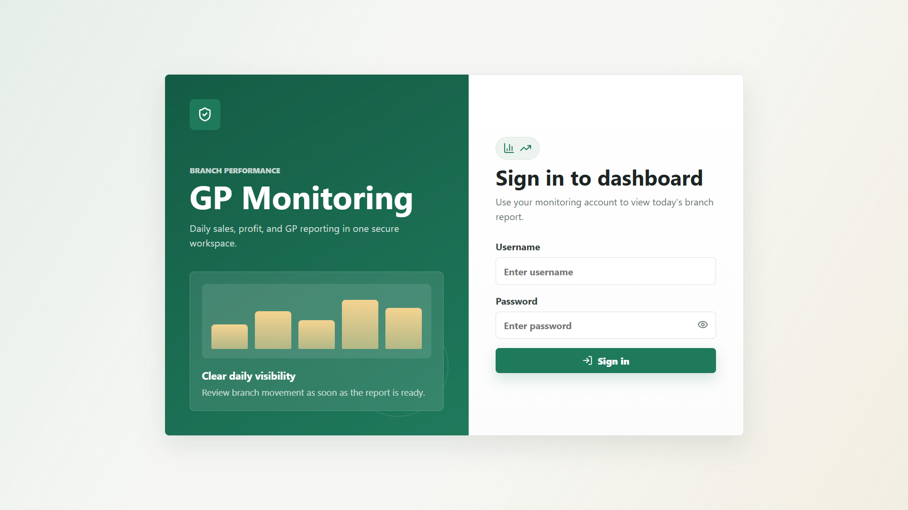
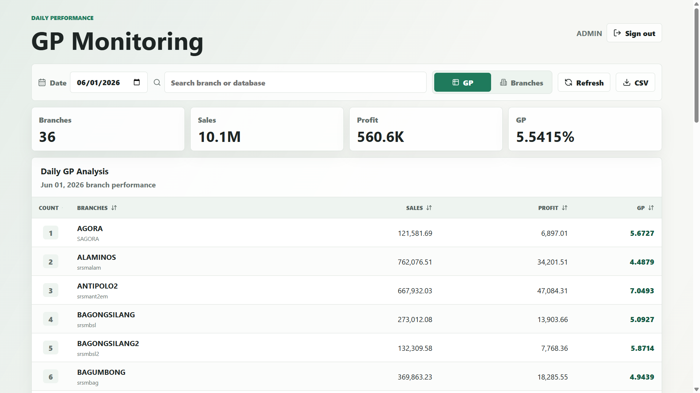

# GP Monitoring

Centralized documentation for the GP Monitoring system.

## System overview

GP Monitoring is a two-part application with a backend API service and a frontend dashboard.

- `gp_monitoring_api/` is a NestJS backend that authenticates users, validates API keys, and provides branch data plus daily GP analysis.
- `gp_monitoring_front/` is a Next.js frontend that proxies backend requests through server-side routes, manages auth via HTTP-only cookies, and displays the dashboard UI.

The frontend and backend are separated to keep API logic and UI logic independent while still sharing secure server-side communication.

## Architecture

### Backend (`gp_monitoring_api`)
- NestJS modules for `auth`, `branches`, and `gp-analysis`
- Guards for API key validation and JWT authentication
- MySQL connection for application data
- MSSQL connection for GP analysis reporting
- `express-session` for session management
- Environment-driven configuration via `dotenv`

### Frontend (`gp_monitoring_front`)
- Next.js App Router for page routing and API proxy routes
- Redux Toolkit for state management
- `lucide-react` for icons and UI visuals
- Server-side route handlers to securely call backend APIs using `GP_API_KEY`
- Client pages for login and the dashboard experience

## Tech stack

- Node.js
- TypeScript
- NestJS 11
- Next.js 14
- React 18
- Redux Toolkit
- MySQL
- Microsoft SQL Server
- `express-session`
- `@nestjs/jwt`
- `mysql2`
- `mssql`
- `dotenv`

## How to run

### Backend

```bash
cd gp_monitoring_api
npm install
npm run start:dev
```

Default backend URL: `http://localhost:3000`

### Frontend

```bash
cd gp_monitoring_front
npm install
npm run dev
```

Default frontend URL: `http://localhost:3010`

## Environment configuration

### Backend
Required environment variables for `gp_monitoring_api`:

- `API_KEY`
- `JWT_SECRET`
- `SESSION_SECRET`
- `MYSQL_HOST`
- `MYSQL_USER`
- `MYSQL_PASSWORD`
- `MYSQL_DATABASE`
- `MYSQL_PORT`
- `MSSQL_HOST`
- `MSSQL_USER`
- `MSSQL_PASSWORD`
- `MSSQL_DATABASE`
- `MSSQL_PORT`
- `GP_ANALYSIS_TABLE`
- `JWT_EXPIRES_IN` (optional)
- `CORS_ORIGINS` (optional)

### Frontend
Required environment variables for `gp_monitoring_front/.env.local`:

- `GP_API_BASE_URL` (backend URL)
- `GP_API_KEY`
- `GP_COOKIE_SECURE`

`GP_API_KEY` must match the backend `API_KEY` and is used only by the frontend server-side routes.

## Notes

- The frontend proxies authenticated requests to the backend rather than calling it directly from browser JavaScript.
- The backend uses API key protection plus JWT/session authentication to secure endpoints.
- For production, use a persistent session store instead of the default in-memory store.

## Illustrations





## Project structure

- `gp_monitoring_api/`
  - `src/auth/`
  - `src/branches/`
  - `src/gp-analysis/`
  - `src/common/guards/`
  - `src/config/`
  - `src/database/`

- `gp_monitoring_front/`
  - `app/`
  - `components/`
  - `lib/`
  - `types/`
